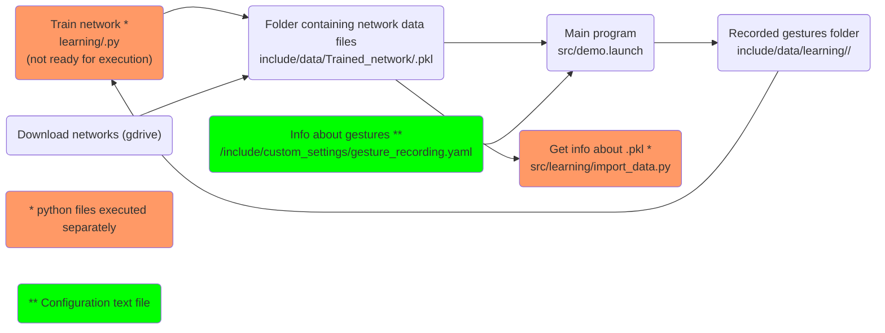

# Robot control via gestures

## Installation

Download installation script [here](https://gitlab.ciirc.cvut.cz/imitrob/mirracle/mirracle_gestures/-/raw/master/installation.sh?inline=false) and run with `bash installation.sh`.

Old installation description file can be found in [installation-old.md](installation-old.md).

If error will show, try to create conda environment. If you don't have anaconda, download it from [link](https://repo.anaconda.com/archive/Anaconda3-2021.05-Linux-x86_64.sh), install with `bash Anaconda3-2021.05-Linux-x86_64.sh`

```
cd ~/$YOUR_WS
conda env create -f environment.yml
```


## Launch the robot

### Simulator

```
# Term 1, Leap Controller
sudo leapd
# Term 2, Simulator demo
source /opt/ros/melodic/setup.bash
roslaunch mirracle_gestures demo.launch simulator:=coppelia
```

Add `gripper:=franka_gripper` for gripper option.

### Real

- Check the Panda Robot light is blue
```
# Term 1, Panda Robot Start
source /opt/ros/melodic/setup.bash
source ~/<panda_ws>/setup.sh
roslaunch panda_launch start_robot.launch
# Term 2, Leap Controller
sudo leapd
# Term 3, Workspace with "motion" package
source /opt/ros/melodic/setup.bash
source ~/<your_ws>/setup.sh
roslaunch mirracle_gestures demo.launch simulator:=real
```

## Manage Gestures

Gesture configurations YAML file is saved in `<this_pkg>/include/custom_settings/gesture_recording.yaml`.

Add new gesture by creating new record under. Gesture list is loaded when program starts.

TODO: Right now all gestures loaded from `network.pkl` needs to have record in this yaml file. Make it independent.

```
staticGestures:
  <gesture 1>:
    key: <keyboard key for recording>
    filename: <picture (icon) of gesture showed in UI>
  <gesture 2>:
    ...
  ...
dynamicGestures:
  <gesture 1>:
    ...
  ...
```


All available networks can be downloaded from google drive with button from UI menu and they are saved in folder `/include/data/Trained_network/`.
To get information about network, run: `rosrun mirracle_gestures import_data.py` then specify network (e.g. network0.pkl). In this file, it can be seen how to load network.

Method of gesture sampling from trained network is saved in `learning/gesture_computation.py`.

Gesture management described above can be summarized into graph:


## Manage Scenes

Scene configurations YAML file is saved in `<this_pkg>/include/custom_settings/scenes.yaml`.

The object needs to have at least _pose_ and _size_.

Scenes are loaded with start of a program and can be switched from menu.

Create new scenes in this file as follows:
```yaml
<Sample scene1 name>:
  <Sample object 1 name>:
    pose:
      # Loads position as dictionary, uses Cartesian coordinates
      position: {'x': 1.0, 'y': 1.0, 'z': 1.0}
      # Loads orientation as dictionary, uses Quaternion values
      orientation: {'x': 1.0, 'y': 1.0, 'z': 1.0, 'w': }
    size: [1.,1.,1.]
    shape: cube # (or sphere, cylinder, cone)
    mass: 0.1
    friction: 0.3
    pub_info: true
  <Sample object 2 name>:
    pose:
      # Loads position as list or tuple, uses Cartesian coordinates (x,y,z)
      position: [1., 1., 1.]
      # Loads orientation as list or tuple (uses notation x,y,z,w)
      orientation: {'x': 1.0, 'y': 1.0, 'z': 1.0, 'w': 1.0}
    size: [1.,1.,1.]
    mesh: <mesh file>.obj
  <Sample object 3 name>:
    pose:
      # Loads position as saved in poses.yaml name
      position: home
      # Loads orientation as saved in poses.yaml name
      orientation: home
    size: [1.,1.,1.]
  <Sample object 4 name>:
    # Loads both position and orientation as saved in poses.yaml name
    pose: home
    size: [1.,1.,1.]
   ...
<Sample scene2 name>:
  ...
```

## Manage Paths

Path configurations YAML file is saved in `<this_pkg>/include/custom_settings/paths.yaml`.

Create new paths in this file as follows:
```yaml
<Sample path1 name>:
  <Sample pose 1 name>:
    pose:
      # Loads position as dictionary, uses Cartesian coordinates
      position: {'x': 1.0, 'y': 1.0, 'z': 1.0}
      # Loads orientation as dictionary, uses Quaternion values
      orientation: {'x': 1.0, 'y': 1.0, 'z': 1.0, 'w': }
    # Grab/Release object
    action:
  <Sample pose 2 name>:
    pose:
      # Loads position as list or tuple, uses Cartesian coordinates (x,y,z)
      position: [1., 1., 1.]
      # Loads orientation as list or tuple (uses notation x,y,z,w)
      orientation: {'x': 1.0, 'y': 1.0, 'z': 1.0, 'w': 1.0}
  <Sample pose 3 name>:
    pose:
      # Loads position as saved in poses.yaml name
      position: home
      # Loads orientation as saved in poses.yaml name
      orientation: home
  <Sample pose 4 name>:
    # Loads both position and orientation as saved in poses.yaml name
    pose: home
   ...
<Sample path2 name>:
  ...
```

## Frequent issues
- `segmentation fault` when launching (or the `thread 17 ended with error`). If Conda environment in use, try:
```
conda update --all
```
- `RuntimeError: RobotInterfacePython: invalid robot model` The robot MoveIt "server" is not launched

- `[Err] [REST.cc:205] Error in REST request
libcurl: (51) SSL: no alternative certificate subject name matches target host name ‘api.ignitionfuel.org’`
Solution:
Open ~/.ignition/fuel/config.yaml:
replace: api.ignitionfuel.org
to: fuel.ignitionrobotics.org

- Try upgrade pip with:
```
pip install --upgrade pip
pip3 install --upgrade pip
```

## GPU Accelerated learning:
- Check kernel version -> need to be 5.4.0
```
uname -a
```
- Check gcc version -> need to be 7.5.0
```
gcc --version
```
- Check what driver suites the linux distribution
```
sudo lshw -C display
```
- Find the packages available
```
sudo apt list nvidia-driver-*
```
- Install the drivers
```
sudo add-apt-repository ppa:graphics-drivers/ppa
sudo apt update
sudo apt install -y nvidia-driver-450
```
- Reboot & Check Installation
```
sudo reboot
sudo nvidia-smi
```
[Source](https://medium.com/@sreenithyc21/nvidia-driver-installation-for-ubuntu-18-04-2020-2918be830d0f)
