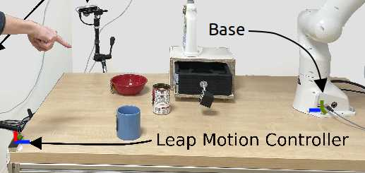

# Teleoperation gesture toolbox v1.1

Welcome to **teleoperation gesture toolbox** package made for **Leap Motion Controller** or D400 series RealSense.
Most of the package utilize **ROS2**. 

## Installation 

Install Leap Motion SDK and API for Python (v3.11), see [script](gesture_detector/leap_motion_install.sh).

I use [miniconda](docs.anaconda.com/miniconda) packaging. Dependency packages are stored in `environment.yml` file.
```Shell
conda install mamba -c conda-forge
mamba env create -f environment.yml # Installs ROS2 Humble via RoboStack utilized for this conda environemnt
mamba activate teleopenv
```

Build as ROS2 package:
```Shell
mkdir -p ~/teleop_ws/src
cd ~/teleop_ws/src
git clone https://github.com/imitrob/teleop_gesture_toolbox.git --depth 1
cd ..
colcon build --symlink-install
rm ~/teleop_ws/build/gesture_detector/gesture_detector/saved_models
ln -s ~/teleop_ws/src/teleop_gesture_toolbox/gesture_detector/saved_models ~/teleop_ws/build/gesture_detector/gesture_detector/saved_models
ln -s ~/teleop_ws/src/teleop_gesture_toolbox/scene_getter/scene_getter/scene_makers/scenes ~/teleop_ws/build/scene_getter/scene_getter/scene_makers/scenes
```

I use following alias to source the environment:
```Shell
alias teleopenv='conda activate teleopenv;
LD_LIBRARY_PATH=\$LD_LIBRARY_PATH:$HOME/LeapAPI/lib/x64/;
source ~/teleop_ws/install/setup.bash'
```

See Leap Motion rigged hands by using [leapjs-rigged-hand](https://github.com/leapmotion/leapjs-rigged-hand).

## Common Gestures dataset

Sample trained model (containing common gestures) is included with the repository (`gesture_detector/saved_models`) and is loaded by default. For more information about training on new dataset, look at section "Gesture dataset collection and detector training".

## Usage 

### Gesture detector (not requires robotics setup)

Run Leap Motion backend: `sudo leapd`

Run gesture detector:
```Shell
teleopenv; ros2 launch gesture_detector gesture_detect_launch.py sensor:=leap # or realsense
```

See the gesture detections on your browser `localhost:8000`.

#### (optional) Run websocket server on specific port 

To run websocket (for live gesture display) on scecific port, first, comment `websocket` node in launch file description and run:
```Shell
teleopenv; ros2 launch rosbridge_server rosbridge_websocket_launch.xml port:=9095
```

### Deictic gesture (Pointing object selection)

Pointing on objects on the scene with your hand will select it. Run: `ros2 run pointing_object_selection selector_node`.

Deictic selector requires scene publisher, publishing the scene object locations. Run `ros2 run scene_getter mocked_scene` to publish mocked scene, or see the script [mocked_scene_maker.py](scene_getter/scene_getter/scene_makers/mocked_scene_maker.py) how it is done.

Secondly, calibration of the Leap Motion Controller with your scene base frame is needed. Transforms are defined in ([saved_config folder](pointing_object_selection/pointing_object_selection/saved_setups/)). `a404.yaml` is valid for example setup (see image [setup.jpg](setup.jpg)) when the Leap Motion controller is opposite from base.  

Example setup


### Gesture sentence processor

By combining multiple gesture types creates a gesture sentence. When pointing gesture is detected, object selection is activated. See example video [here](http://imitrob.ciirc.cvut.cz/publications/chi23/2023_IROS_GESTURE_SENTENCE_VIDEO.mp4).

Requires gesture detector (`teleopenv; ros2 launch gesture_detector gesture_detect_launch.py`) and deictic node (`ros2 run pointing_object_selection selector_node`) running.

Then gesture sentence processor is launch with

```
ros2 run gesture_sentence_maker sentence_maker
```

After gesture sentence finishes (hand no longer visible), processed gestures are sent and you should see `HRI Command original` results on your browser (`localhost:8000`).

### Mapping gestures to Robotic Actions

Get gesture meaning and convert detected gestures to (robotic) actions. Run: `ros2 run gesture_meaning gesture_meaning_service`

Service is launching 1 to 1 constant mapping by default. Note that gesture set must match the current gesture set. See *OneToOneMapping* class in [gesture_meaning_service.py](src/teleop_gesture_toolbox/gesture_meaning/gesture_meaning/gesture_meaning_service.py).

By running the service, mappings are published to `/hri/command` topic.

### Action execution by the robotic manipulator

Part that executes the actions with robitic manipulator is moved to separate [repository](https://github.com/imitrob/imitrob_templates) compatibility with this package is currently under development.


### Gesture Direct Teleoperation (requires robotics setup)

Direct teleoperation is a separate subpackage (*live_teleoperation* folder)

Tested robot is Franka Emika Panda and [panda_py](https://github.com/JeanElsner/panda-py) `pip install panda-python`. See implementation in `robot.py`.

Servoing happens in task space (cartesian controller).

#### Usage:

1. Run Leap Motion backend: `sudo leapd`
2. Run Leap Motion ROS2 publisher: `teleopenv; ros2 run gesture_detector leap`
3. Run servo: `python servoing.py`
    - Default is teleoperate by drawing.
    - Right hand for teleoperation, Left hand to close and open gripper.

## Gesture dataset collection and detector training

The sample dataset can be downloaded from [link](https://drive.google.com/file/d/17L5KEuhW9kLYC073t11jctynQQ6z2Qm0/view?usp=sharing). The dataset needs to be saved to `gesture_detector/gesture_data` folder.

To create your owndataset, run:

`teleopenv; python gesture_detector/hand_processing/leap.py --record_with_enter --recording_gesture_name <your gesture name>`

Use Enter to record 1 sec long gesture demonstration saved as hand movement to `gesture_detector/gesture_data` folder.

I like to also run the marker publisher: `teleopenv; ros2 launch gesture_detector hand_marker_pub`
and rviz to see the hand: `teleopenv; rviz2 -d gesture_detector/live_display/hand_cfg.rviz`

To train the static gestures, run:

`teleopenv; gesture_classification/pymc_lib.py --gestures <gesture 1 name> <gesture 2 name> <gesture n name>` script, where gesture names are your gesture names. By default, gesture names are the ones from sample dataset.

After training is done, see the  model in `gesture_detector/saved_models` folder. To set the model, adjust model in `launch/gesture_detect_launch.py` file.

