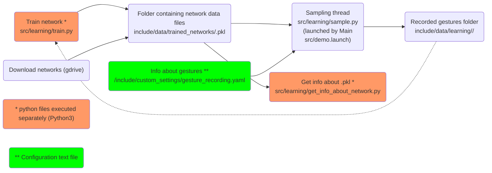

# Teleoperation gesture toolbox v0.01

Python gesture toolbox for teleoperating robotic arm. The toolbox covers both static and dynamic gestures in several representations, including ProMP.

## Installation

Tested on Linux Ubuntu 20.04.

### Dependencies

- Conda, e.g. Miniconda [download](https://docs.conda.io/en/latest/miniconda.html)
- [Coppelia Sim](https://www.coppeliarobotics.com/) simulator
  - (Recommended) Use version 4.1 (PyRep can have problems with newer versions)
  - Please install Coppelia Sim files to your home folder: `~/CoppeliaSim` (as shown below):
```
cd ~
wget --no-check-certificate https://www.coppeliarobotics.com/files/CoppeliaSim_Edu_V4_1_0_Ubuntu20_04.tar.xz
tar -xf CoppeliaSim_Edu_V4_1_0_Ubuntu20_04.tar.xz
mv CoppeliaSim_Edu_V4_1_0_Ubuntu20_04 CoppeliaSim
rm CoppeliaSim_Edu_V4_1_0_Ubuntu20_04.tar.xz
cd CoppeliaSim
rm libsimExtROS2Interface.so # Official ROS2 interface needs to be disabled
```

- [Leap Motion Controller](https://www.ultraleap.com/product/leap-motion-controller/) as a hand sensor ([install](include/scripts/leap_motion_install.sh))

### Packages install with Mamba and ROS2 workspace setup:
1. Set your ROS2 workspace path with: `export ws=<path/to/your/colcon/ws>`, e.g. `export ws=/home/$USER/teleop_ws`
2. Go through installation process in [include/scripts/installation.sh](include/scripts/installation.sh) script.

- Use sample dataset example (recommended):
  - Download [dataset (1.2GB)](https://drive.google.com/file/d/1Jitk-MxzczreZ81PuO86xTapuSkBMOb-/view?usp=sharing) and move the `learning` folder to match the `<gesture_toolbox>/include/data/learning` folder
- Use sample trained network example (recommended):
  - Download [model (22MB)](https://drive.google.com/file/d/1jyDatUJy10sdXmLjPEdHL1cfSo-RZ4ct/view?usp=share_link) and move the file to `/include/data/trained_networks` folder

## Launching

### Launch Backend

```Shell
source ~/activate_teleop_backend.sh
ros2 launch teleop_gesture_toolbox backend.launch
```
- This launches:
  1. Leap software backend (Shell command: `sudo leapd`)
  2. Leap Motion Controller ROS publisher (`ros2 run teleop_gesture_toolbox leap_run.py`) (Script: `leapmotion/leap.py`)
  3. Static gestures detection (`ros2 run teleop_gesture_toolbox static_sample_thread_run.py`) (`gesture_classification/main_sample_thread.py`)
  4. Dynamic gestures detection (`ros2 run teleop_gesture_toolbox dynamic_sample_thread_run.py`) (`gesture_classification/dynamic_sample_thread.py`)
  5. Coppelia Sim simulator with Panda robot from *Coppelia Sim ROS interface package* (`ros2 run coppelia_sim_ros_interface server_run.py`) (`coppelia_sim_ros_server.py`)

- **Note**: You can run nodes separately via `ros2 run <package> <python file>` as shown
- **Note**: If you can't see the Leap Motion Controller Near-infrared lights, run `sudo leapd`


### Examples

- Now you can run examples in second terminal

#### Coppelia Sim example

- Example of controlling CoppeliaSim scene and Panda robot using ROS2 interface
- You can look at `<coppelia_sim_ros_interface>/examples/coppelia_sim_ros_example.py` script
```Shell
source ~/activate_teleop_backend.sh
ros2 run coppelia_sim_ros_interface example_run.py
```

#### Gesture Recognitions

- Launches GUI only for gesture detection feedback (without use of simulator)  

```Shell
source ~/activate_teleop.sh
ros2 run teleop_gesture_toolbox example_grec.py
```

#### Run GUI/Manager (with connection to Coppelia Sim)

- Starts a GUI with demo (TODO: needs some tuning)
```Shell
source ~/activate_teleop.sh
ros2 run teleop_gesture_toolbox main_coppelia.py
```

## Recognizers

### Static gestures with Probabilistic Neural Network

- (Default)
- Preprocessing (based on config chosen in given script):
```Shell
cd <your ws>/src/teleop_gesture_toolbox/teleop_gesture_toolbox/learning
python pymc3_train.py
```

### Dynamic gestures with Dynamic Time Warping

- (Default)
- Preprocessing not needed


## Application

1. Motion planning
  - Path execution: Pick 'Play path' on Drop-down list
  - Path selection is made in second Drop-down list
  - To Add/Edit paths in this list, go to [here](#manage-paths)

2. Live mapping with _Leap Motion_ and gesture detection
  - Pick 'Live hand' in left Drop-down list
  - Note: Leap Motion needs to be connected to see this option and Leap software (`sudo leapd`) must be running
  - On the left panel can be seen what gestures has been detected, pointing arrow indicates probabilistic solution

Features:
1. Switch between environments in _Menu->Robot config.->Environment_
2. Switch between scenes _Menu->Scene_, more about scenes in [here](#manage-scenes)
3. Switch between gesture detection NN files in _Menu->Gestures->Pick detection network_, new NN files can be downloaded (_Menu->Gestures->Download networks from gdrive_)

## Manage Gestures

Gesture configurations YAML file is saved in `<gestures pkg>/include/custom_settings/gesture_recording.yaml`. Add new gesture by creating new record under `staticGestures` or `dynamicGestures` (below). Note that gesture list is updated when program starts.

`gesture_recording.yaml`:
```
staticGestures:
  <gesture 1>:
    key: <keyboard key for recording>
    filename: <picture (icon) of gesture showed in UI>
  <gesture 2>:
    ...
  ...
dynamicGestures:
  <gesture 1>:
    ...
  ...
```

TODO: Right now all gestures loaded from `network.pkl` needs to have record in this yaml file. Make it independent.


All available networks can be downloaded from google drive with button from UI menu and they are saved in folder `<gestures pkg>/include/data/trained_networks/`.
To get information about network, run: `python get_info_about_network.py` (located in `/learning` folder) then specify network (e.g. `network0.pkl`).

Train new NN with script (`src/learning/pymc3_train.py`). Running script via IPython is advised for better orientation in learning processes. TODO: Publish recorded data-set to gdrive

Gesture management described above can be summarized into graph:


## Manage Scenes

Scene configurations YAML file is saved in `<teleop_gesture_toolbox pkg>/include/custom_settings/scenes.yaml`.

The object needs to have at least _pose_ and _size_.

Scenes are loaded with start of a program and can be switched from menu.

Create new scenes in this file as follows:
```yaml
<Sample scene1 name>:
  <Sample object 1 name>:
    pose:
      # Loads position as dictionary, uses Cartesian coordinates
      position: {'x': 1.0, 'y': 1.0, 'z': 1.0}
      # Loads orientation as dictionary, uses Quaternion values
      orientation: {'x': 1.0, 'y': 1.0, 'z': 1.0, 'w': }
    size: [1.,1.,1.]
    shape: cube # Loads shape object (or sphere, cylinder, cone)
    mass: 0.1 # [kg]
    friction: 0.3 # [-] Coefficient
    pub_info: true # Info about object is published to topic (/coppelia/object_info)
  <Sample object 2 name>:
    pose:
      # Loads position as list or tuple, uses Cartesian coordinates (x,y,z)
      position: [1., 1., 1.]
      # Loads orientation as list or tuple (uses notation x,y,z,w)
      orientation: {'x': 1.0, 'y': 1.0, 'z': 1.0, 'w': 1.0}
    size: [1.,1.,1.]
    mesh: <mesh file>.obj # Loads mesh file from include/models
  <Sample object 3 name>:
    pose:
      # Loads position as saved in poses.yaml name
      position: home
      # Loads orientation as saved in poses.yaml name
      orientation: home
    size: [1.,1.,1.]
  <Sample object 4 name>:
    # Loads both position and orientation as saved in poses.yaml name
    pose: home
    size: [1.,1.,1.]
   ...
<Sample scene2 name>:
  ...
```

## Manage Paths
Path configurations YAML file is saved in `<teleop_gesture_toolbox pkg>/include/custom_settings/paths.yaml`.

Create new paths in this file as follows:
```yaml
<Sample path1 name>:
  <Sample pose 1 name>:
    pose:
      # Loads position as dictionary, uses Cartesian coordinates
      position: {'x': 1.0, 'y': 1.0, 'z': 1.0}
      # Loads orientation as dictionary, uses Quaternion values
      orientation: {'x': 1.0, 'y': 1.0, 'z': 1.0, 'w': }
    # Grab/Release object
    action:
  <Sample pose 2 name>:
    pose:
      # Loads position as list or tuple, uses Cartesian coordinates (x,y,z)
      position: [1., 1., 1.]
      # Loads orientation as list or tuple (uses notation x,y,z,w)
      orientation: {'x': 1.0, 'y': 1.0, 'z': 1.0, 'w': 1.0}
  <Sample pose 3 name>:
    pose:
      # Loads position as saved in poses.yaml name
      position: home
      # Loads orientation as saved in poses.yaml name
      orientation: home
  <Sample pose 4 name>:
    # Loads both position and orientation as saved in poses.yaml name
    pose: home
   ...
<Sample path2 name>:
  ...
```
