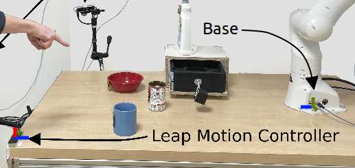

# Teleoperation gesture toolbox v1.1

Welcome to **teleoperation gesture toolbox** package made for **Leap Motion Controller**.
Most of the package utilize **ROS2**. 

## Installation 

Install Leap Motion SDK and API for Python (v3.11), see [script](gesture_detector/leap_motion_install.sh).

Dependency packages are stored in `environment.yml` file.
```Shell
conda install mamba -c conda-forge
mamba create -f environment.yml # Installs ROS2 Humble via RoboStack utilized for this conda environemnt
mamba activate teleopenv
```

Build as ROS2 package:
```Shell
mkdir -p <your_ws>/src
git clone https://github.com/imitrob/teleop_gesture_toolbox.git --depth 1 --branch dev
cd <your_ws>
colcon build --symlink-install
```

I use following alias to source the environment:
```Shell
alias teleopenv='conda activate teleopenv;
LD_LIBRARY_PATH=\$LD_LIBRARY_PATH:$HOME/LeapAPI/lib/x64/;
source install/setup.bash'
```

See Leap Motion rigged hands by using [leapjs-rigged-hand](https://github.com/leapmotion/leapjs-rigged-hand).

## Common Gestures dataset

Sample trained model (containing common gestures) is included with the repository (`gesture_detector/saved_models`) and is loaded by default. 

(optional) The sample dataset can be downloaded from [link](https://drive.google.com/file/d/17L5KEuhW9kLYC073t11jctynQQ6z2Qm0/view?usp=sharing). To train the dataset, save it to `gesture_detector/gesture_data` folder. Then train static gestures by using `pymc_lib.py` script.

## Usage 

### Gesture detector

Run Leap Motion backend: `sudo leapd`

Run gesture detector:
```Shell
teleopenv; ros2 launch gesture_detector gesture_detect_launch.py
```

See the gesture detections on your browser `localhost:8000`.

#### (optional) Create link for saved_models

You may want to create link to gesture detection models, so that models in `src` folder are also recognized in `install` folder.

```Shell
rm ~/<your_ws>/build/gesture_detector/gesture_detector
ln -s ~/<your_ws>/src/teleop_gesture_toolbox/gesture_detector/saved_models ~/<your_ws>/build/gesture_detector/gesture_detector
```

#### (optional) Run websocket server on specific port 

To run websocket (for live gesture display) on scecific port, first, comment `websocket` node in launch file description and run:
```Shell
teleopenv; ros2 launch rosbridge_server rosbridge_websocket_launch.xml port:=9095
```

### Deictic gesture (Pointing object selection)

Pointing on objects on the scene with your hand will select it. Run `python deictic_node.py`.

Deictic selector requires scene publisher, publishing the scene object locations. Run and see script [mocked_scene_maker.py](scene_getter/scene_getter/scene_makers/mocked_scene_maker.py) that publishes example scene positions.

Secondly, calibration of the Leap Motion Controller with your scene base frame is needed. Transform is defined in ([transform.py](pointing_object_selection/pointing_object_selection/transform.py)) is valid for example setup (see image [setup.jpg](setup.jpg)) when the Leap Motion controller is opposite from base.  

Example setup


### Gesture sentence processor

By combining multiple gesture types creates a gesture sentence. When pointing gesture is detected, object selection is activated. See example video [here](http://imitrob.ciirc.cvut.cz/publications/chi23/2023_IROS_GESTURE_SENTENCE_VIDEO.mp4).

Requires gesture detector (`teleopenv; ros2 launch gesture_detector gesture_detect_launch.py`) and deictic node (`python deictic_node.py`) running.

Then gesture sentence processor is launch with

```
ros2 launch gesture_sentence_maker sentence_maker_launch.py
```
or run script:
```
python gesture_processor.py
```

After gesture sentence finishes (hand no longer visible), processed gestures are sent and you should see `HRI Command original` results on your browser (`localhost:8000`).

### Mapping gestures to Robotic Actions

> Tutorial coming soon

### Gesture Direct Teleoperation

> Tutorial coming soon

